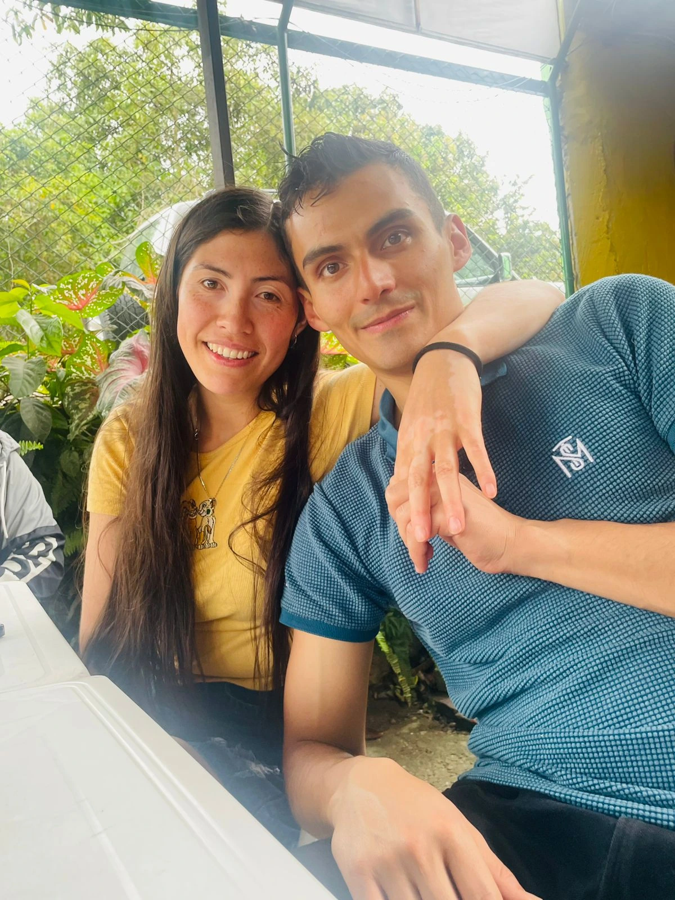
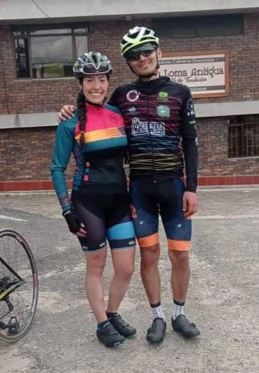
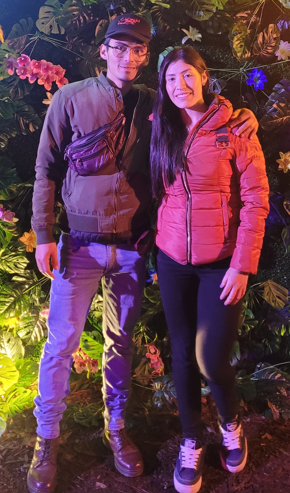

<!DOCTYPE html>
<html lang="es">

<head>

<meta charset="UTF-8">

<meta name="viewport"
content="width=device-width, initial-scale=1.0">

<title>

Jhon & Adriana | Nuestra Boda

</title>

<meta name="description"
content="Con mucha alegría queremos compartir contigo el día más importante de nuestras vidas.">

<meta name="theme-color"
content="#14375A">

<meta property="og:type"
content="website">

<meta property="og:title"
content="Jhon & Adriana | Nos Casamos">

<meta property="og:description"
content="26 de Septiembre de 2026">

<meta property="og:image"
content="assets/img/og-image.jpg">

<meta property="og:url"
content="https://TU-USUARIO.github.io/Invitacion-Jhon-Adriana/">

<link rel="icon"
href="favicon.ico">

<link rel="stylesheet"
href="assets/css/style.css">

<link rel="preconnect"
href="https://fonts.googleapis.com">

<link rel="preconnect"
href="https://fonts.gstatic.com"
crossorigin>

<link href="https://fonts.googleapis.com/css2?family=Great+Vibes&family=Cormorant+Garamond:wght@300;400;500;600;700&display=swap"
rel="stylesheet">

</head>

<body>

<header class="hero">

<section class="hero__content">

Con la bendición de Dios

<h1>

Jhon

&

Adriana

</h1>

Nos Casamos

Sábado

 

26 de Septiembre de 2026

<a

href="#galeria"

class="button">

Descubrir

</a>

</section>

</header>

<main>

<section

id="galeria"

class="gallery">

<h2>

Nuestra Historia

</h2>

Cada fotografía representa
un momento especial del camino
que hoy nos lleva al altar.

</section>

<section
id="ceremonia"
class="section">

<h2>

Ceremonia

</h2>

<article class="card">

<h3>

Parroquia San Juan Crisóstomo

</h3>

Av. Suba #119-75

 

Bogotá

🕓 4:00 p.m.

<a

target="_blank"

class="button secondary"

href="https://www.google.com/maps/search/?api=1&query=Parroquia+San+Juan+Crisostomo+Bogota">

Cómo llegar

</a>

</article>

</section>
<!-- ===================================== -->
    <!-- RECEPCIÓN -->
    <!-- ===================================== -->

    <section id="recepcion" class="panel">

        

            <h2 class="section-title">
                Recepción
            </h2>

            <article class="card">

                

                <h3>
                    Centro Deportivo Choquenzá
                </h3>

                

                    Cra. 71d #120-01

                     

                    Bogotá D.C.

                

                

                    🕕 6:00 p.m.

                

                <a
                    href="https://www.google.com/maps/search/?api=1&query=Centro+Deportivo+Choquenza+Bogota"
                    target="_blank"
                    class="button">

                    Cómo llegar

                </a>

            </article>

        

    </section>

    <!-- ===================================== -->
    <!-- CÓDIGO DE VESTIMENTA -->
    <!-- ===================================== -->

    <section id="vestimenta" class="panel light">

        

            <h2 class="section-title">

                Código de Vestimenta

            </h2>

            <article class="dress-card">

                

                <h3>

                    Formal

                </h3>

                

                    Se reserva el uso de los colores

                    <strong>

                        blanco, azul y verde menta.

                    </strong>

                

                

                    

                    

                    

                

            </article>

        

    </section>

    <!-- ===================================== -->
    <!-- CONFIRMACIÓN -->
    <!-- ===================================== -->

    <section id="confirmacion" class="panel">

        

            <h2 class="section-title">

                Confirma tu asistencia

            </h2>

            

                Tu respuesta nos ayudará a preparar
                este día tan especial.

            

            

                <a

                    href="https://wa.me/573505902079?text=Hola%20Jhon%20y%20Adriana,%20confirmo%20que%20S%C3%8D%20asistir%C3%A9%20a%20su%20boda."

                    target="_blank"

                    class="button success">

                    ✅ Sí asistiré

                </a>

                <a

                    href="https://wa.me/573505902079?text=Hola%20Jhon%20y%20Adriana,%20lamentablemente%20no%20podr%C3%A9%20acompa%C3%B1arlos%20en%20su%20boda."

                    target="_blank"

                    class="button danger">

                    ❌ No podré asistir

                </a>

            

        

    </section>

    <!-- ===================================== -->
    <!-- FRASE -->
    <!-- ===================================== -->

    <section class="quote">

        

            <blockquote>

                “La bici nos unió,

                 

                y hoy elegimos caminar

                 

                juntos el resto del camino.”

            </blockquote>

        

    </section>
       <!-- ===================================== -->
    <!-- PIE DE PÁGINA -->
    <!-- ===================================== -->

    <footer class="footer">

        

            <h2>

                ¡Los esperamos!

            </h2>

            

                Gracias por acompañarnos
                en uno de los días más importantes
                de nuestras vidas.

            

            

            <h3>

                Jhon
                ❤
                Adriana

            </h3>

            

                26 de Septiembre de 2026

            

        

    </footer>

</main>

<!-- ===================================== -->
<!-- BOTÓN FLOTANTE WHATSAPP -->
<!-- ===================================== -->

<!-- ===================================== -->
<!-- SCRIPT -->
<!-- ===================================== -->

</body>

</html> 
/*====================================================

    INVITACIÓN BODA
    JHON & ADRIANA

====================================================*/

/*=====================================
=            VARIABLES
=====================================*/

:root{

    --primary:#14375A;
    --secondary:#F6EFE5;
    --white:#FFFFFF;
    --text:#2E2E2E;
    --gray:#777777;

    --radius:18px;

    --shadow:

        0 15px 35px rgba(0,0,0,.08);

}

/*=====================================
=            RESET
=====================================*/

*{

    margin:0;
    padding:0;
    box-sizing:border-box;

}

html{

    scroll-behavior:smooth;

}

body{

    background:var(--white);

    color:var(--text);

    font-family:

    'Cormorant Garamond',

    serif;

    overflow-x:hidden;

    line-height:1.7;

}

/*=====================================
=            IMÁGENES
=====================================*/

img{

    display:block;

    max-width:100%;

}

/*=====================================
=            ENLACES
=====================================*/

a{

    text-decoration:none;

}

/*=====================================
=            CONTENEDOR
=====================================*/

.wrapper{

    width:min(1100px,92%);

    margin:auto;

}

/*=====================================
=            TÍTULOS
=====================================*/

h1{

    font-family:

    'Great Vibes',

    cursive;

    font-size:5rem;

    color:white;

    font-weight:400;

}

h2{

    font-size:2.6rem;

    color:var(--primary);

    margin-bottom:20px;

    text-align:center;

}

h3{

    font-size:1.8rem;

    color:var(--primary);

    margin-bottom:10px;

}

p{

    font-size:1.25rem;

}

/*=====================================
=            HERO
=====================================*/

.hero{

    position:relative;

    width:100%;

    height:100vh;

    overflow:hidden;

}

/* Imagen principal */

.hero__image{

    width:100%;

    height:100%;

    object-fit:cover;

}

/* Capa oscura */

.hero__overlay{

    position:absolute;

    inset:0;

    background:

    linear-gradient(

    rgba(0,0,0,.30),

    rgba(0,0,0,.45)

    );

}

/* Texto principal */

.hero__content{

    position:absolute;

    inset:0;

    display:flex;

    flex-direction:column;

    justify-content:center;

    align-items:center;

    text-align:center;

    color:white;

    padding:25px;

}

.hero__welcome{

    letter-spacing:2px;

    font-size:1.15rem;

    margin-bottom:15px;

}

.hero h1 span{

    display:block;

    font-size:4rem;

    margin:10px 0;

}

.hero__subtitle{

    margin-top:15px;

    font-size:2rem;

}

.hero__date{

    margin-top:35px;

    font-size:1.5rem;

    line-height:2;

}

/*=====================================
=            BOTONES
=====================================*/

.button{

    display:inline-block;

    margin-top:40px;

    background:var(--primary);

    color:white;

    padding:

    15px

    45px;

    border-radius:50px;

    transition:.30s;

    font-size:1.1rem;

    letter-spacing:1px;

}

.button:hover{

    transform:translateY(-3px);

    box-shadow:

    0 12px 25px

    rgba(0,0,0,.20);

}

.button.secondary{

    background:white;

    color:var(--primary);

    border:

    solid 2px

    var(--primary);

}

.button.success{

    background:#1faa59;

}

.button.danger{

    background:#b33b3b;

}
/*=====================================
=            GALERÍA
=====================================*/

.gallery{

    padding:90px 0;

    background:var(--secondary);

}

.gallery .wrapper{

    text-align:center;

}

.gallery p{

    max-width:650px;

    margin:auto;

    margin-bottom:45px;

    color:var(--gray);

}

/*=====================================
=            SLIDER
=====================================*/

.slider{

    width:min(1100px,92%);

    margin:auto;

    overflow:hidden;

    border-radius:var(--radius);

    box-shadow:var(--shadow);

    background:white;

}

.slides{

    display:flex;

    transition:transform .7s ease;

}

.slides img{

    width:100%;

    flex-shrink:0;

    object-fit:cover;

    aspect-ratio:16/10;

}

.slider-dots{

    display:flex;

    justify-content:center;

    gap:10px;

    padding:20px;

}

.slider-dots span{

    width:12px;

    height:12px;

    border-radius:50%;

    background:#d7d7d7;

    transition:.3s;

    cursor:pointer;

}

.slider-dots span.active{

    background:var(--primary);

}

/*=====================================
=            SECCIONES
=====================================*/

.panel{

    padding:90px 0;

}

.panel.light{

    background:var(--secondary);

}

.section-title{

    text-align:center;

    margin-bottom:45px;

}

/*=====================================
=            TARJETAS
=====================================*/

.card{

    max-width:700px;

    margin:auto;

    background:white;

    padding:45px;

    border-radius:var(--radius);

    text-align:center;

    box-shadow:var(--shadow);

}

.icon{

    width:72px;

    margin:auto;

    margin-bottom:20px;

}

.card h3{

    margin-bottom:18px;

}

.card p{

    color:var(--gray);

}

.hour{

    display:inline-block;

    margin-top:18px;

    margin-bottom:25px;

    font-size:1.3rem;

    font-weight:600;

    color:var(--primary);

}

/*=====================================
=      CÓDIGO DE VESTIMENTA
=====================================*/

.dress-card{

    max-width:650px;

    margin:auto;

    background:white;

    border-radius:var(--radius);

    padding:45px;

    text-align:center;

    box-shadow:var(--shadow);

}

.dress-card p{

    margin-top:15px;

}

.dress-colors{

    display:flex;

    justify-content:center;

    gap:30px;

    margin-top:35px;

}

.dress-color{

    width:55px;

    height:55px;

    border-radius:50%;

    border:2px solid #ddd;

}

.white{

    background:#ffffff;

}

.blue{

    background:#14375A;

}

.mint{

    background:#9FD8C0;

}

/*=====================================
=          CONFIRMACIÓN
=====================================*/

.section-text{

    text-align:center;

    margin-bottom:40px;

    color:var(--gray);

}

.buttons{

    display:flex;

    justify-content:center;

    gap:25px;

    flex-wrap:wrap;

}

.buttons .button{

    margin-top:0;

    min-width:220px;

    text-align:center;

}

/*=====================================
=            FRASE
=====================================*/

.quote{

    padding:120px 25px;

    background:linear-gradient(

        rgba(20,55,90,.88),

        rgba(20,55,90,.88)

    ),

    url("../img/foto3.webp");

    background-size:cover;

    background-position:center;

    color:white;

    text-align:center;

}

.quote blockquote{

    max-width:850px;

    margin:auto;

    font-family:

    'Great Vibes',

    cursive;

    font-size:3rem;

    line-height:1.5;

}
/*=====================================
=            FOOTER
=====================================*/

.footer{

    background:var(--primary);

    color:white;

    padding:70px 0 50px;

    text-align:center;

}

.footer h2{

    color:white;

    margin-bottom:20px;

}

.footer h3{

    color:white;

    font-family:'Great Vibes',cursive;

    font-size:3rem;

    font-weight:400;

    margin:25px 0 10px;

}

.footer p{

    color:rgba(255,255,255,.85);

}

.footer-divider{

    width:120px;

    height:1px;

    background:rgba(255,255,255,.35);

    margin:35px auto;

}

.footer-date{

    margin-top:12px;

    letter-spacing:1px;

}

.heart{

    color:#f7d6d6;

}

/*=====================================
=       WHATSAPP FLOTANTE
=====================================*/

.whatsapp{

    position:fixed;

    right:25px;

    bottom:25px;

    width:60px;

    height:60px;

    border-radius:50%;

    background:#25D366;

    display:flex;

    justify-content:center;

    align-items:center;

    box-shadow:0 12px 25px rgba(0,0,0,.18);

    transition:.25s;

    z-index:999;

}

.whatsapp:hover{

    transform:scale(1.08);

}

.whatsapp img{

    width:34px;

    height:34px;

}

/*=====================================
=          ANIMACIÓN SUAVE
=====================================*/

body{

    animation:fade .45s ease;

}

@keyframes fade{

    from{

        opacity:0;

    }

    to{

        opacity:1;

    }

}

/*=====================================
=          RESPONSIVE TABLET
=====================================*/

@media(max-width:900px){

    h1{

        font-size:4.2rem;

    }

    h2{

        font-size:2.2rem;

    }

    .card,
    .dress-card{

        padding:35px;

    }

}

/*=====================================
=          RESPONSIVE MÓVIL
=====================================*/

@media(max-width:768px){

    .hero{

        height:100svh;

    }

    h1{

        font-size:3.4rem;

        line-height:1.2;

    }

    .hero h1 span{

        font-size:2.8rem;

    }

    .hero__subtitle{

        font-size:1.6rem;

    }

    .hero__date{

        font-size:1.25rem;

    }

    h2{

        font-size:2rem;

    }

    h3{

        font-size:1.45rem;

    }

    p{

        font-size:1.08rem;

    }

    .panel{

        padding:70px 0;

    }

    .card{

        padding:30px 22px;

    }

    .dress-card{

        padding:30px 22px;

    }

    .quote{

        padding:80px 20px;

    }

    .quote blockquote{

        font-size:2.2rem;

    }

    .buttons{

        flex-direction:column;

        align-items:center;

    }

    .buttons .button{

        width:100%;

        max-width:340px;

    }

    .whatsapp{

        width:55px;

        height:55px;

        right:18px;

        bottom:18px;

    }

}

/*=====================================
=       MÓVILES PEQUEÑOS
=====================================*/

@media(max-width:480px){

    h1{

        font-size:2.9rem;

    }

    .hero h1 span{

        font-size:2.4rem;

    }

    .hero__welcome{

        font-size:1rem;

    }

    .hero__subtitle{

        font-size:1.35rem;

    }

    .hero__date{

        font-size:1.1rem;

    }

    .button{

        width:100%;

        max-width:280px;

        text-align:center;

    }

    .slider{

        border-radius:12px;

    }

    .icon{

        width:60px;

    }

    .dress-colors{

        gap:18px;

    }

    .dress-color{

        width:42px;

        height:42px;

    }

    .footer h3{

        font-size:2.5rem;

    }

    .quote blockquote{

        font-size:1.9rem;

    }

}

/*=====================================
=         FIN DEL CSS
=====================================*/
/*==================================================
    INVITACIÓN JHON & ADRIANA
    JavaScript
==================================================*/

document.addEventListener("DOMContentLoaded", () => {

    /*=========================================
      CARRUSEL
    =========================================*/

    const slides = document.querySelector(".slides");
    const images = document.querySelectorAll(".slides img");
    const dots = document.querySelectorAll(".slider-dots span");

    if (!slides || images.length === 0) return;

    let current = 0;
    const total = images.length;

    function updateSlider() {

        slides.style.transform =
            `translateX(-${current * 100}%)`;

        dots.forEach((dot, index) => {

            dot.classList.toggle(
                "active",
                index === current
            );

        });

    }

    function nextSlide() {

        current++;

        if (current >= total) {

            current = 0;

        }

        updateSlider();

    }

    let autoSlide = setInterval(nextSlide, 4500);

    /*=========================================
      PUNTOS INDICADORES
    =========================================*/

    dots.forEach((dot, index) => {

        dot.addEventListener("click", () => {

            current = index;

            updateSlider();

            clearInterval(autoSlide);

            autoSlide = setInterval(nextSlide, 4500);

        });

    });

    /*=========================================
      DESLIZAMIENTO TÁCTIL
    =========================================*/

    let startX = 0;
    let endX = 0;

    slides.addEventListener("touchstart", e => {

        startX = e.touches[0].clientX;

    });

    slides.addEventListener("touchend", e => {

        endX = e.changedTouches[0].clientX;

        const distance = startX - endX;

        if (distance > 50) {

            current++;

        }

        if (distance < -50) {

            current--;

        }

        if (current >= total) {

            current = 0;

        }

        if (current < 0) {

            current = total - 1;

        }

        updateSlider();

        clearInterval(autoSlide);

        autoSlide = setInterval(nextSlide, 4500);

    });

    /*=========================================
      INICIALIZAR
    =========================================*/

    updateSlider();
